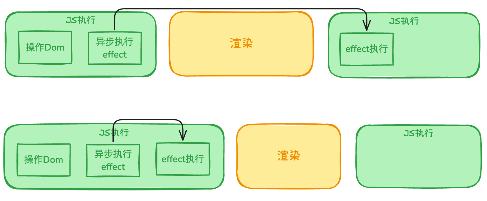

# useState

1. useState 的初始值可以是一个函数，这个函数只能写一些同步的逻辑，不支持异步
2. useState 返回一个数组，包含 state 和一个更新 state 的 api，通常命名为 setxxx
3. 这个 setxxx 的 api 也有两个传参方式：
   - 直接传值
   - 也可以是一个函数，这个函数的参数是上一次的 state

# useEffect

effect 官方翻译为副作用，那么什么是副作用呢？
在 react 中，函数组件通常是一个纯函数，传入 props，返回对应的结果，再次调用，传入 props，依然返回同样的结果。但是有了 effect 之后，每次执行函数，额外执行了一些逻辑，这些逻辑不就是副作用吗？

1. useEffect 的第一个参数是一个 effect 函数，这个函数不支持 async
2. useEffect 的第二个参数是一个数组，react 会根据它是否变化来决定是否执行 effect 函数
   - 如果没传，则每次都会执行
   - 传了一个空数组，只会执行一次
3. effect 函数可以 return 一个函数
   - 这个函数会在 state 改变，effect 函数重新执行之前执行
   - 在组件销毁的时候也会执行

# useLayoutEffect

uselayoutEffect 与 useEffect 类似。在绝大多数情况下，uselayoutEffect 和 useEffect 的效果是一样的。有一点区别是：useLayoutEffect 里面的 effect 函数是同步执行的

我们知道 js 的执行和渲染是阻塞的：

useEffect 的 effect 函数会在操作 dom 之后异步执行：

所以当在 useEffect 中执行一些操作时，这些逻辑会以单独的宏任务或者微任务的形式存在，进入 Event Loop 调度执行。那么 effect 有可能在下一次渲染之前执行，也有可能在下一次渲染完之后才执行完成。

这样就导致有的时候页面会出现闪动，因为第一次渲染的时候 state 是之前的值，渲染完之后执行了 effect 更新了 state，再次渲染成最新的值。如果你不希望页面出现闪动，那么可以使用 useLayoutEffect。它与 useEffect 的区别是它的 effect 执行是同步的，浏览器会等到 effect 执行完再渲染。

但是需要注意的是：
当 effect 执行的时间很长，那么将会阻塞页面的渲染，有可能会导致掉帧

所以一般情况下，还是让 effect 逻辑异步执行好。

也就是说，绝大多数情况下，用 useEffect，它能避免因为 effect 逻辑执行时间长导致页面卡顿（掉帧）。 但如果你遇到闪动的问题比较严重，那可以用 useLayoutEffect，但要注意 effect 逻辑不要执行时间太长。

# useReducer

前面用到的 setState 都是直接修改值，那如果在修改值之前需要执行一些固定的逻辑呢？
这时候就要用 useReducer 了：

1. useReducer 的类型参数传入 Reducer<数据类型,action 的类型>
2. useReducer 的第一个参数是 reducer 函数，第二个参数是初始数据

```tsx
import { Reducer, useReducer } from "react";

interface Data {
  result: number;
}

interface Action {
  type: "add" | "minus";
  num: number;
}
function reducer(state: Data, action: Action) {
  switch (action.type) {
    case "add":
      return {
        result: state.result + action.num,
      };
    case "minus":
      return {
        result: state.result - action.num,
      };
  }
  return state;
}

function App() {
  const [res, dispatch] = useReducer<Reducer<Data, Action>>(reducer, {
    result: 0,
  });

  return (
    <div>
      <div onClick={() => dispatch({ type: "add", num: 2 })}>加</div>
      <div onClick={() => dispatch({ type: "minus", num: 1 })}>减</div>
      <div>{res.result}</div>
    </div>
  );
}

export default App;
```

一般来说，使用 useState 会比 useReducer 简洁得多。但是遇到 setState 之前需要执行比较复杂的逻辑场景时，使用 useState 需要在每个地方都执行一遍这个逻辑，而用 useReducer 则是把它封装到 reducer 里，通过 action 触发就好了。所以：**当修改 state 的逻辑比较复杂时，使用 useReducer**

useReducer 还有另一种重载：**通过函数来创建初始数据**

```tsx
const [data, dispath] = useReducer<Reducer<Data, Action>>(
  reducer,
  "zero",
  (param) => {
    return {
      result: param === "zero" ? 0 : 1,
    };
  }
);
```

这个时候，useReducer 的第二个参数就是传给这个函数的参数，并且在类型参数里也需要传入它的类型

# useReducer + immer

使用 useReducer 有一个需要注意的地方:如果修改了 state，直接返回是不会触发页面的重新渲染的，必须返回一个新的对象才可以

比如：当触发 add 动作时，页面并没有发生重新渲染

```tsx
function reducer(state, action) {
  switch (action.type) {
    case "add":
      state.result = state.result + action.num;
      return state;
    case "minus":
      return {
        result: state.result - action.num,
      };
  }
  return state;
}
```

每次都返回一个新的对象，如果对象的数据结构很复杂，每次都创建一个新的对象比较繁琐，而且性能也不好

比如：

```tsx
import React, { useReducer, Reducer } from "react";

interface Data {
  a: {
    c: {
      e: number;
      f: number;
    };
    d: number;
  };
  b: number;
}

interface Action {
  type: "add" | "minus";
  num: number;
}

function reducer(state, action) {
  switch (action.type) {
    case "add":
      return {
        ...state,
        a: {
          ...state.a,
          c: {
            ...state.a.c,
            e: state.a.c.e + action.num,
          },
        },
      };
    case "minus":
      return {
        ...state,
        a: {
          ...state.a,
          c: {
            ...state.a.c,
            e: state.a.c.e - action.num,
          },
        },
      };
  }
  return state;
}

function App() {
  const [res, dispath] = useReducer<Reducer<Data, Action>>(reducer, {
    a: {
      c: {
        e: 1,
        f: 7,
      },
      d: 4,
    },
    b: 2,
  });

  return (
    <div>
      <div onClick={() => dispath({ type: "add", num: 2 })}>➕</div>
      <div onClick={() => dispath({ type: "minus", num: 1 })}>➖</div>
      <div>{JSON.stringify(res)}</div>
    </div>
  );
}

export default App;
```

这里的 data 是一个复杂的对象结果，我们需要修改其中的一个属性 e。但是为了返回一个新的对象，我们需要把其余的属性都复制一遍。这会导致写起来很麻烦，也不好维护。
有没有什么更好的方式呢？

> immutable 相关的库可以用来解决这类问题，比较常用的是 **immer**

安装 immer：

```bash
pnpm install --save immer
```

使用 immer：
用 produce 来创建一个新的对象，第一个参数是需要修改的对象，第二个参数是一个函数，在这个函数里面直接修改这个对象的属性，返回的结果是一个新的对象

```tsx
function reducer(state, action) {
  switch (action.type) {
    case "add":
      return produce(state, (draftState) => {
        draftState.a.c.e += action.num;
      });
    case "minus":
      return {
        ...state,
        a: {
          ...state.a,
          c: {
            ...state.a.c,
            e: state.a.c.e - action.num,
          },
        },
      };
  }
  return state;
}
```

在 react 中，只要涉及到 state 的修改，就必须返回新的对象，不管是 useState 还是 useReducer

# useRef

在 react 如何保存一个 dom 的引用呢？这时候就需要用到一个叫 useRef 的 hook

```tsx
import React, { useRef, useEffect } from "react";

function App() {
  const inputRef = useRef<HTMLInputElement>();

  useEffect(() => {
    inputRef.current.focus();
  }, []);

  return (
    <div>
      <input ref={inputRef} type="text" />
    </div>
  );
}

export default App;
```

useRef 的类型参数是保存的内容的类型，ref 的内容是保存在 current 属性上的。ref 其实是一个有 current 属性的对象，除了可以保存 dom 引用，也可以放别的东西。

```tsx
import React, { useRef, useEffect } from "react";

function App() {
  const inputRef = useRef<HTMLInputElement>();
  const numRef = useRef<number>(0);

  useEffect(() => {
    inputRef.current.focus();
  }, []);

  return (
    <div>
      <input ref={inputRef} type="text" />
      <div onClick={() => (numRef.current += 1)}>{numRef.current}</div>
    </div>
  );
}

export default App;
```

但是它不会重新渲染页面，如果想让页面重新渲染，还是的修改 state

```tsx
import React, { useRef, useEffect, useState } from "react";

function App() {
  const inputRef = useRef<HTMLInputElement>();
  const numRef = useRef<number>(0);
  const [, forceRender] = useState<number>(0);

  useEffect(() => {
    inputRef.current.focus();
  }, []);

  return (
    <div>
      <input ref={inputRef} type="text" />
      <div
        onClick={() => {
          numRef.current += 1;
          forceRender(Math.random());
        }}
      >
        {numRef.current}
      </div>
    </div>
  );
}

export default App;
```

一般来说是不会这么用的，useRef 一般是用来存一些不是用于渲染的内容的。单个组件内如何拿到 ref 我们学会了，那么如果是想把子组件的 ref 传递给父组件呢？
react 有一个专门的 api 来解决这个问题：forwardRef

# forwardRef + useImperativeHandle

forwardRef 做的事情其实就是将 ref 传递子组件的内部,这样就把子组件的 input 的 ref 传递到了父组件

```tsx
import React, { useRef, useEffect, useState } from "react";

const Children: React.ForwardRefRenderFunction<HTMLInputElement> = (
  props,
  ref
) => {
  return (
    <div>
      <input ref={ref} type="text" />
    </div>
  );
};

const WrapedChildren = React.forwardRef(Children);

function App() {
  const inputRef = useRef<HTMLInputElement>();
  const numRef = useRef<number>(0);
  const [, forceRender] = useState<number>(0);

  useEffect(() => {
    inputRef.current.focus();
  }, []);

  return (
    <div>
      <WrapedChildren ref={inputRef} />
      <div
        onClick={() => {
          numRef.current += 1;
          forceRender(Math.random());
        }}
      >
        {numRef.current}
      </div>
    </div>
  );
}

export default App;
```

被 forwardRef 包裹的组件的类型要用 React.forwardRefRenderFunction 类型，
第一个类型参数是 ref 的 comtent 的类型，第二个类型参数是 props 的类型。但是有的时候，我们并不想把原生的标签暴露出去，而是暴露一些自定义的内容。

这个时候就要用到 **useImperativeHandle** 的 hook 了

它有 3 个参数：

- 第一个是传入的 ref
- 第二个是返回新的 ref 值的函数
- 第三个是依赖的数组

useImperativeHandle 的作用其实就是自定义了 ref 对象

# useContext

useContext 通常用来处理跨多层组件之间的数据传递。
用法：

1. 用 createContext 创建 context 对象
2. 用 provider 修改其中的值
3. function 组件里用 useContext 的 hook 来取值，class 组件使用 Consumer 来取值。

# useMemo 和 useCallback

这两个 hook 通常是用来做性能优化的

```tsx
import React, { memo, useState, useEffect } from "react";

function App() {
  const [, setNum] = useState<number>(0);

  useEffect(() => {
    setInterval(() => {
      setNum(Math.random());
    }, 2000);
  }, []);

  return (
    <div>
      <ChildrenB />
    </div>
  );
}

function ChildrenB() {
  console.log("rendering ChildrenB");
  return <div>ChildrenB</div>;
}

export default App;
```

当组件的 state 变化时，会触发组件的重新渲染，此时子组件也会重新渲染。但是如果子组件依赖的数据并没有发生变化，那么这时我们是不希望子组件进行重新渲染的，这个时候我们就可以使用 memo 进行优化。

```tsx
import React, { memo, useState, useEffect } from "react";

interface ChildrenBProps {
  count: number;
}

function App() {
  const [, setNum] = useState<number>(0);

  useEffect(() => {
    setInterval(() => {
      setNum(Math.random());
    }, 2000);
  }, []);

  return (
    <div>
      <MemoChildrenB count={2} />
    </div>
  );
}

function ChildrenB(props: ChildrenBProps) {
  console.log("rendering ChildrenB");
  return <div>ChildrenB</div>;
}

const MemoChildrenB = memo(ChildrenB);

export default App;
```

memo 的作用是**只有 props 变的时候，才会重新渲染被包裹的组件**

```tsx
import React, { memo, useState, useEffect } from "react";

interface ChildrenBProps {
  count: number;
}

function App() {
  const [num, setNum] = useState<number>(0);

  useEffect(() => {
    setInterval(() => {
      setNum(Math.random());
    }, 2000);
  }, []);

  return (
    <div>
      <MemoChildrenB count={num} />
    </div>
  );
}

function ChildrenB(props: ChildrenBProps) {
  console.log("rendering ChildrenB");
  return <div>ChildrenB</div>;
}

const MemoChildrenB = memo(ChildrenB);

export default App;
```

我们修改 props，你会发现 2s 就会打印一次

使用 memo 时，一般还会结合两个 Hook 使用：useMemo 和 useCallback

> memo 是防止 props 没变时的重新渲染，useMemo 和 useCallback 是防止 props 的不必要变化

我们给 ChildrenB 组件添加一个 callback 方法

```tsx
import React, { memo, useState, useEffect } from "react";

interface ChildrenBProps {
  count: number;
  callback: () => void;
}

function App() {
  const [num, setNum] = useState<number>(0);

  useEffect(() => {
    setInterval(() => {
      setNum(Math.random());
    }, 2000);
  }, []);

  const callback = () => {};

  return (
    <div>
      <MemoChildrenB count={0} callback={callback} />
    </div>
  );
}

function ChildrenB(props: ChildrenBProps) {
  console.log("rendering ChildrenB");
  return <div>ChildrenB</div>;
}

const MemoChildrenB = memo(ChildrenB);

export default App;
```

我们发现 memo 失效了，这是因为 state 改变之后，父组件重新执行了，callback 也重新创建了。也就是说 props 发生了改变，固然 ChildrenB 也重新渲染了。这种时候就需要用上 useCallback 了：

```tsx
import React, { memo, useState, useEffect, useCallback } from "react";

interface ChildrenBProps {
  count: number;
  callback: () => void;
}

function App() {
  const [num, setNum] = useState<number>(0);

  useEffect(() => {
    setInterval(() => {
      setNum(Math.random());
    }, 2000);
  }, []);

  const callback = useCallback(() => {}, []);

  return (
    <div>
      <MemoChildrenB count={0} callback={callback} />
    </div>
  );
}

function ChildrenB(props: ChildrenBProps) {
  console.log("rendering ChildrenB");
  return <div>ChildrenB</div>;
}

const MemoChildrenB = memo(ChildrenB);

export default App;
```

useCallback 的作用就是当 deps 数组不变的时候，始终返回同一个 function，当 deps 变的时候，才把 function 改为新传入的值。

useMemo 和 useCallback 类似，都需要和 memo 一起配合使用。只不过它保存的不是函数，而是值。

综上：如果子组件用了 memo，那给它传递的对象、函数类的 props 就需要用 useCallback 或者 useMemo 包裹，否则每次 Props 都会变，memo 就没用了。

反之，如果 props 使用 useMemo 和 useCallback，但是子组件没有被 memo 包裹，那也没意义，因为不管 props 变没变都会重新渲染，只是做了无用功。

memo + useCallback 或 useMemo 是搭配着来用的，少了任何一方，都会使优化失效

**但 useMemo 和 useCallback 也不只是配合 memo 用的：**

比如有个值的计算，需要很大的计算量，你不想每次都算，这时候也可以用 useMemo 来缓存
